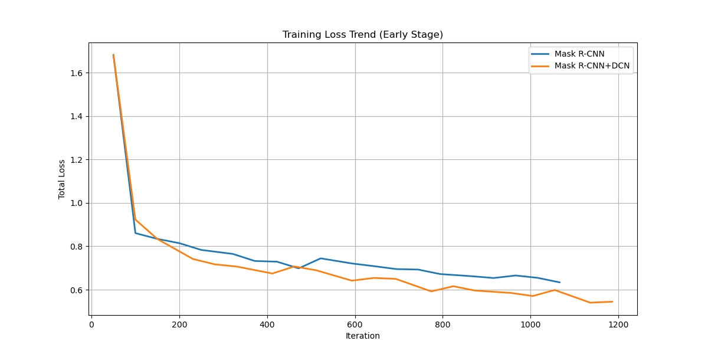
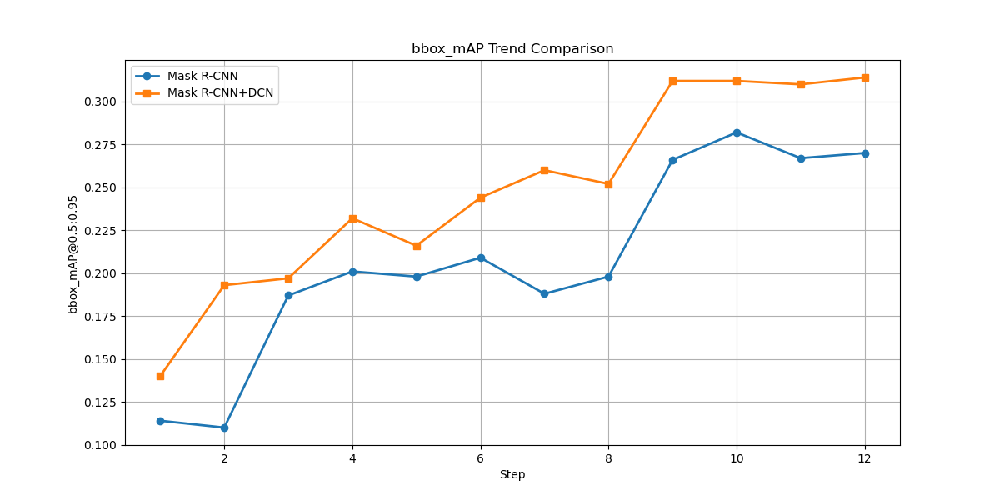
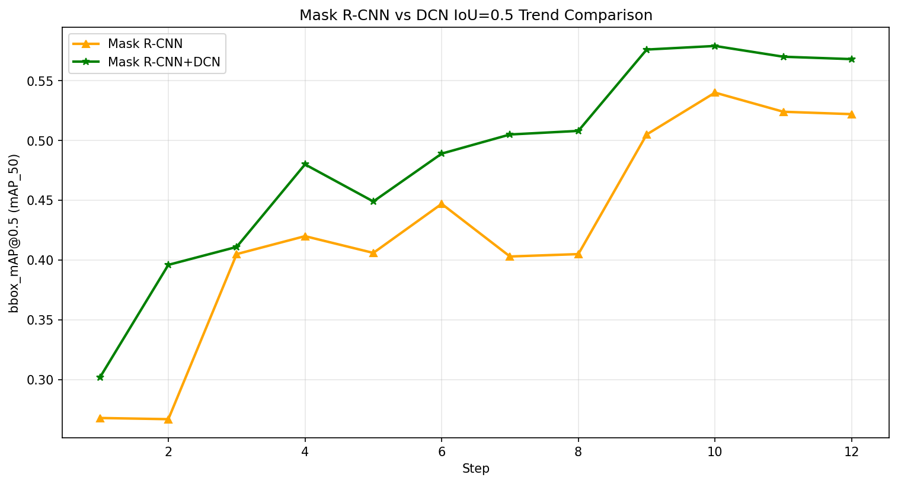
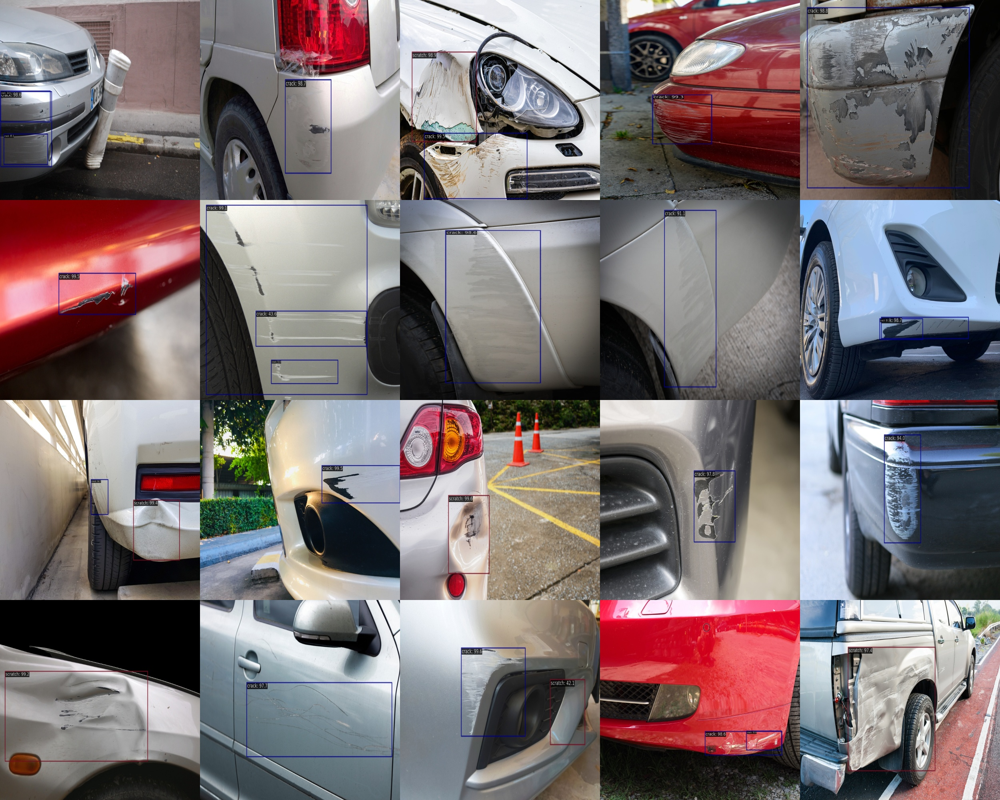

### 项目介绍

本项目是一个计算机视觉入门的练手项目，使用了公开数据集CarDD进行训练，
CarDD 的代码仓库地址 [CarDD](https://github.com/CarDD-USTC/CarDD-USTC.github.io)

本项目主要对 CarDD 数据集使用 MaskRCNN 和 DCN 模型进行训练，得到训练结果。
使用了 `mmdetection` 框架进行训练，涉及到 `mmdetection` 环境的搭建，配置文件的使用，以及训练结果可视化。

并对训练结果进行了简单的分析。

### CarDD 数据集介绍

该数据集主要用于进行车损评估。

损伤类型：dent, scratch, crack, glass shatter, tire flat, and lamp broken
凹陷、划痕、裂纹、玻璃破碎、轮胎、大灯损坏

目录结构
```
CarDD_COCO
	annotations
		instances_test2017.json
		instances_train2017.json
		instances_val2017.json
	train2017 包含2816张图片
	test2017 包含374张图片
	val2017 包含810张图片
```

总计 4000张图片，810/4000=20% 2816/4000=70%  
训练集、测试集、验证集的比例是7:1:2

### 将CarDD数据集的6个类别减少为3个类别

6个类别分别是  
('dent', 'scratch', 'crack', 'glass shatter', 'lamp broken', 'tire flat')  
分表代表 凹陷、划痕、开裂、玻璃碎裂、灯泡损坏、轮胎压坏  
由于这里只关心前3个类别，因此只保留前3个类别，分别是  
('dent', 'scratch', 'crack')  

具体做法参考 [数据集减少类别](dataset_process.md)

### 基础环境安装

参考 [安装环境](env_setup.md)

### 进行训练

机器参数
RTX 3090 24GB

代码拉取时需要添加参数`--recurse-submodules`，否则无法拉取 `mmdetection` 子模块。
```
git clone --recurse-submodules https://github.com/pluone/CarDD.git
```

将 `configs/car_damage` 目录复制到 `mmdetection/configs` 目录下

数据集准备，将解压后的数据集放到目录`CarDD_dataset` 目录下


使用 MaskRCNN 模型训练，使用配置文件 `mask_rcnn_cfg` 配置来执行训练 
```
cd mmdetection
python tools/train.py configs/car_damage/mask_rcnn_cfg.py --work-dir work_dirs/mask_rcnn_cfg
```

使用 DCN 模型来训练，使用配置文件 `configs/car_damage/dcn_cfg.py`
```
python tools/train.py configs/car_damage/dcn_cfg.py --work-dir work_dirs/dcn_cfg
```

### 训练结果对比

`./results`目录中有两次训练的结果文件，通过 `result_compare.py` 生成可视化结果

#### 损失对比
从图中可以看到使用DCN模型的得到更低的损失


#### 预测结果对比

从图中可以看到使用DCN模型得到的预测结果更准确，精度从一开始的 0.14 一直上升到 最后的 0.314  
而使用 MaskRCNN 模型得到的预测结果精度从一开始的 0.114 上升到 最后的 0.27


在 bbox_mAP 0.5 阈值下DCN模型的最好结果是 0.522 明显优于 MaskRCNN 模型


### 测试集结果的可视化

首先生成测试结果文件 `result.pkl`
```
python tools/test.py configs/car_damage/dcn_cfg.py work_dirs/dcn_cfg/epoch_12.pth --out=./work_dirs/dcn_cfg/result.pkl
```

使用 `analyze_results.py` 分析测试结果文件
```
python tools/analysis_tools/analyze_results.py configs/car_damage/dcn_cfg.py \
work_dirs/dcn_cfg/result.pkl \
work_dirs/dcn_cfg/results \
--show-score-thr 0.3
```
在 `work_dirs/dcn_cfg/results` 目录下会生成 `good` 和 `bad` 目录，good 目录中有最优的20张图片

这里我们通过 `concat_result.py` 来将目录下的所有图片进行合并到一张上，
```
python concat_result.py mmdetection/work_dirs/dcn_cfg/results/good --size 500 500
```
结果如下


### 进一步的工作
1. 尝试使用其他其他模型进行训练，例如原作者提出的 DCN-plus 模型

