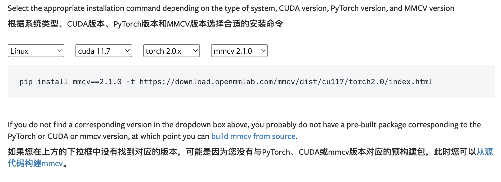

本项目需要安装mmdet，其依赖mmcv，
mmcv 有预构建包，需要根据 cuda+torch+mmcv 的版本来确定是否有预构建包
可从官网进行确定，如果没有预构建包，需要从源码进行构建，速度非常慢，不推荐。

[官方文档地址](https://mmcv.readthedocs.io/en/latest/get_started/installation.html)

由于最新版本的mmdet 3.3.0的setup.py 文件中要求`mmcv<2.2.0`

```
mmcv>=2.0.0rc4,<2.2.0
mmengine>=0.7.1,<1.0.0
```

因此选择使用 mmcv==2.1.0，从截图中看到对应的 cuda 11.7 torch 2.0.x  
因此在租赁GPU平台上也需要选择对应的基础环境版本。

#### mmcv 2.1.0 安装


安装预编译的 mmcv 2.1.0

```
pip install mmcv==2.1.0 -f https://download.openmmlab.com/mmcv/dist/cu117/torch2.0/index.html
```


#### MMDetection 3.3.0 安装

这里使用源码模式进行安装
```
git clone https://github.com/open-mmlab/mmdetection.git
cd mmdetection
pip install -v -e .
# "-v" 指详细说明，或更多的输出
# "-e" 表示在可编辑模式下安装项目，因此对代码所做的任何本地修改都会生效，从而无需重新安装。
```


### 验证安装

#### 验证 mmdet 的版本

```
import mmdet
print(mmdet.__version__)
# 预期输出：3.3.0 或其他版本号
```

#### 使用 mmdet 进行推理验证

**步骤 1.** 我们需要下载配置文件和模型权重文件。

```
pip install -U openmim
mim download mmdet --config rtmdet_tiny_8xb32-300e_coco --dest .
```

**步骤 2.** 推理验证。

```
python demo/image_demo.py demo/demo.jpg rtmdet_tiny_8xb32-300e_coco.py --weights rtmdet_tiny_8xb32-300e_coco_20220902_112414-78e30dcc.pth --device cpu
```

这里执行代码的时候会报错提示 numpy 2.2.6 版本太高，需要降级到 1.x，这里直接降级到 1.x 的最后一个版本 1.26.4

```
pip install numpy==1.26.4
```

然后再次执行上述命令，
你会在当前文件夹中的 outputs/vis 文件夹中看到一个新的图像 demo.jpg，图像中包含有网络预测的检测框。
